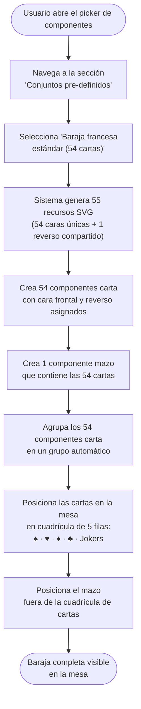

- **Name**: Baraja francesa estándar (54 cartas) — Conjunto pre-definido
- **Code**: 00236
- **Type**: change
- **Creation date**: 2026-09-03

## Full description

Se añade al picker de componentes una nueva sección llamada **"Conjuntos pre-definidos"**, separada visualmente de los tipos de componente individuales existentes. Esta sección agrupa opciones que crean, de una sola acción y sin modal de configuración, colecciones completas de componentes listos para usar.

El primer conjunto disponible es la **Baraja francesa estándar (54 cartas)**. Al seleccionarla, el sistema genera automáticamente e inmediatamente todo lo necesario para tener una baraja completa funcional sobre la mesa:

### Qué se crea

1. **55 recursos SVG** en la galería de recursos:
   - 54 caras de carta únicas (una por cada carta de la baraja)
   - 1 reverso compartido (patrón geométrico simple en blanco y azul, usado por las 54 cartas)

2. **54 componentes carta** con su cara frontal y reverso asignados.

3. **1 componente mazo** que contiene los identificadores de las 54 cartas.

4. **1 grupo automático** que agrupa los 54 componentes carta (no el mazo).

### Diseño de las cartas

Los **4 palos** y sus colores:
- ♠ Picas → negro
- ♣ Tréboles → negro
- ♥ Corazones → rojo
- ♦ Diamantes → rojo

Los **valores** de cada palo: A, 2, 3, 4, 5, 6, 7, 8, 9, 10, J, Q, K (13 cartas × 4 palos = 52 cartas).

Más **2 Jokers** idénticos (mismo SVG para ambos).

**Diseño de carta estándar (2–10):** fondo blanco, símbolo del palo en el centro de la carta, valor en la esquina superior izquierda e inferior derecha, en el color correspondiente al palo.

**Diseño especial del As (A):** el símbolo del palo aparece notablemente más grande y centrado que en el resto de cartas numéricas, siguiendo la convención visual de la baraja francesa estándar.

**Diseño especial de figuras (J, Q, K):** incluyen un elemento visual diferenciador simplificado que los identifica como figura (p. ej. una corona estilizada o adorno adicional), sin ilustraciones fotorrealistas.

**Jokers:** diseño con símbolo de jester, multicolor, idéntico para ambas cartas.

**Reverso:** patrón geométrico simple (p. ej. rombos o líneas cruzadas) en blanco y azul, común a las 54 cartas.

### Disposición en la mesa

Las 54 cartas se colocan en la mesa en una **cuadrícula de 5 filas** ordenadas:
- Fila 1: ♠ Picas (A → K, de izquierda a derecha)
- Fila 2: ♥ Corazones (A → K)
- Fila 3: ♦ Diamantes (A → K)
- Fila 4: ♣ Tréboles (A → K)
- Fila 5: 2 Jokers (alineados a la izquierda)

La separación entre cartas es de ancho de carta × 1,1. El mazo se posiciona fuera de esta cuadrícula, en una posición aparte sobre la mesa.

### Flujo de creación

### Decisiones de alcance acordadas

- Los recursos SVG se crean siempre con nombres descriptivos únicos (p. ej. `baraja-francesa-picas-as.svg`); no se verifica ni deduplica con recursos existentes.
- Los 2 Jokers son idénticos: un único SVG referenciado por ambas cartas.
- El grupo automático incluye solo las 54 cartas, no el mazo.
- La sección "Conjuntos pre-definidos" es completamente nueva y no altera los tipos de componente individuales existentes.

### Diseño del picker (mockup de referencia)

- El mockup de referencia del picker es **`design_picker-menu-estilo-real.html`**: reproduce el modal real "Añadir componente" (`src/ui/componentTypeModal.js`) con sus tokens y estructura reales (cabecera simple sin fondo oscuro, lista vertical de tipos con radio + icono lineal + label, footer con "Cancelar" / "Aceptar").
- Sobre ese modal real, el cambio añade: un rótulo "Componentes" sobre la lista existente, un separador "o elige un conjunto completo" y la nueva sección "Conjuntos pre-definidos".
- El item "Baraja francesa estándar (54 cartas)" es un **item de acción inmediata**, no de selección: no tiene radio, se distingue visualmente (fondo `--accent-blue-light`, borde `--accent-blue`, tags informativas y chevron `›`) y, al pulsarlo, crea la baraja y cierra el modal directamente **sin pasar por el botón "Aceptar"**. "Aceptar" sigue aplicando solo a la selección de un tipo individual.
- Se descartó una exploración visual alternativa con tema oscuro y rejilla de componentes; no representa el estilo real de la aplicación.

## Technical notes

- El picker de componentes actual es `src/ui/componentTypeModal.js`. El array `COMPONENT_TYPES` (líneas 8-68) define las entradas actuales; la nueva sección "Conjuntos pre-definidos" requerirá un nuevo mecanismo (sección separada o array propio) en este mismo modal, o un nuevo modal/panel dedicado a conjuntos.
- Los tipos existentes relevantes son `carta` y `mazo` (`DEFAULT_CARTA_PROPERTIES` y `DEFAULT_MAZO_PROPERTIES` en `src/ui/componentModal.js`, líneas ~131 y ~155); la baraja los reutiliza sin crear un nuevo tipo.
- Los recursos se gestionan en `src/core/resource.js`: se crean con `createResource` como objetos `{ id, name, type, dataUrl, fileName, mimeType }`. Los SVG se almacenan como data URIs. La creación masiva de 55 recursos en una sola acción no tiene precedente en el código actual; habrá que generar los SVGs en memoria y llamar a `createResource` 55 veces o equivalent.
- No existe ningún mecanismo de creación masiva de componentes (`addComponent` en `src/core/state.js:58-63` añade uno a la vez). Habrá que iterar 54 veces para las cartas.
- Los grupos se crean asignando un `groupId` común al campo correspondiente de cada componente; el registro de grupo se crea con `nextGroupId()` en `component.js:130-138`. No hay función de agrupación masiva existente.
- El posicionamiento en cuadrícula deberá calcularse y asignarse explícitamente a cada componente (`x`, `y`), ya que el sistema no tiene motor de layout automático.
- Inconsistencia detectada entre docs y código: `design/docs/architecture` referenciado en `pv-context.json` no existe en el repositorio.
