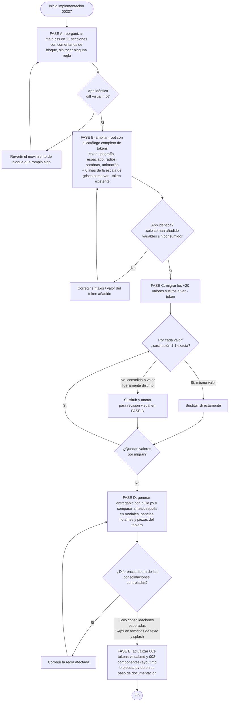

- **Creation date**: 2026-09-09

## (a) Functional notes

**Fuera de alcance:**

- **Modo oscuro.** No se implementa. Este cambio deja todos los colores como variables en `:root` para que un cambio futuro añada el bloque de modo oscuro; hoy no se añade ningún `@media (prefers-color-scheme)` ni selector de tema.
- **Partición de `main.css` en varios archivos.** Descartada. `src/scripts/build.py` lee un único `CSS_REL_PATH = 'styles/main.css'` y lo incrusta inline en `<style>`; partir el archivo obligaría a tocar `build.py` y mantener un orden de concatenación. Se mantiene **un único archivo**, solo reorganizado por dentro.
- **Auditoría exhaustiva línea por línea de las ~3.702 líneas.** No entra. Se definen todos los tokens y se migra solo la lista cerrada de valores sueltos ya identificada (`design_data_migracion-valores-sueltos.md`, más los 4 casos extra que la fase técnica localizó — ver más abajo). Cada área de mejora visual posterior migrará los suyos cuando toque esa parte del estilo.
- **Consolidación de todas las apariciones de cada tamaño de texto.** Solo se migran los usos ya identificados; los tokens `--text-*` quedan definidos para que las áreas siguientes los apliquen.
- **Dos tokens actuales que no entran en ninguna escala** (`--bg-table-dot`, `--section-accent`): se mantienen intactos, no se tocan ni se renombran.
- **Tokens definidos sin uso inmediato** (algunos pasos de espaciado, curvas de animación, `--info`/`--warning` y sus variantes, varios pasos de radio): es la base compartida para las áreas siguientes, no deuda. Se dejan definidos aunque nadie los consuma todavía.

**Dudas resueltas en el análisis técnico:**

- **¿Destino del `rgba(44,125,216,0.2)` suelto (`main.css:1903`, anillo de foco de `.rotation-slider__mark--active`)?** → Se consolida en `--accent-blue-alpha-25`. Motivo: es un anillo de foco `0 0 0 3px` sobre un elemento **seleccionado/activo** (la marca activa del control de rotación), que es exactamente el caso de uso de `--shadow-focus-strong` (opacidad 0,25). La diferencia 0,20 → 0,25 es de 5 centésimas de alfa sobre un halo de 3px: imperceptible. No se crea un cuarto token `--accent-blue-alpha-20`.
- **¿Las sombras con forma distinta sobre el azul (`0 2px 6px rgba(44,125,216,0.15)` en `main.css:1641`, `2260`; `0 2px 5px rgba(44,125,216,0.35)` en `main.css:2314`) pasan a token semántico?** → **No** en este cambio. No son anillos de foco (`0 0 0 3px`), son sombras de elevación teñidas de azul en 3 sitios con dos formas distintas. Darles token semántico implica decidir un nombre y un valor canónico que hoy no está claro, y no hay repetición suficiente. Se dejan tal cual; se migra solo la parte de color a `var(--accent-blue-alpha-15)` / `var(--accent-blue-alpha-35)` **manteniendo la forma literal de cada sombra** (`0 2px 6px var(--accent-blue-alpha-15)`, etc.), que sí es sustitución de color 1:1.
- **¿Se unifican `--transition-fast` y `--duration-fast` (ambos 150ms)?** → **No** en este cambio. `--transition-fast: 150ms ease` está consumido en ~40 reglas y su valor incluye la curva (`ease`). Se mantiene `--transition-fast` intacto y se añade `--duration-fast: 150ms` (solo duración) como parte del set de duraciones nuevo. La unificación (migrar los ~40 usos) es trabajo del área de microinteracciones, no de este cambio. Se anota en la sección (d) para que la documentación deje constancia de que conviven a propósito durante la transición.
- **¿Orden de las variables en `:root` y agrupación de los 6 alias de la escala de grises?** → Ver el orden completo en la tarea 2 de la sección (b). Los alias de grises van **agrupados en su propio sub-bloque** (`--gray-100` … `--gray-900`) justo después de los colores semánticos, cada uno como `var(--token-existente)` con un comentario que indica de qué token es alias; los 3 pasos con valor propio (`--gray-500`, `--gray-600`, `--gray-800`) llevan su literal en ese mismo sub-bloque, en su posición de escala.
- **¿Los 4 valores sueltos extra que aparecieron al revisar el código real?** Se confirmó con el análisis que entran en la migración de esta fase, como casos "sustituir y revisar visualmente":
  - `rgba(255,255,255,0.08)` (`main.css:88`, hover de `.file-block` sobre fondo oscuro): se consolida en `--toolbar-hover` (0,10). Diferencia de 2 centésimas de alfa.
  - `rgba(255,255,255,0.15)` (`main.css:296`, hover reforzado de un botón sobre fondo oscuro): se consolida en `--toolbar-hover` (0,10). Se revisa en el entregable que el hover sigue distinguiéndose.
  - `#999999` (`main.css:1543`, `background` de un punto decorativo) y `#999` (`main.css:2419`, `background` de un handle): ambos a `var(--gray-600)` (`#999999`), sustitución 1:1.
  - `rgba(255,255,255,0.9)` (`main.css:1255`, fondo semiopaco de `.document-viewer` sobre la mesa): **NO se migra**. No es un blanco de superficie de modal ni de toolbar; es un fondo translúcido específico de una pieza sobre la mesa. Queda anotado como fuera de la lista cerrada, igual que `--bg-table-dot`.
- **¿La reorganización en 11 secciones puede romper la cascada CSS?** → Riesgo real: mover un bloque cambia su orden y puede alterar qué regla gana ante igual especificidad. Mitigación: la FASE A se hace **solo moviendo bloques y añadiendo cabeceras de comentario, sin editar ninguna propiedad**, y se valida con comparación visual antes de tocar tokens (ver diagrama en la sección (b) y checklist (e)).

## (b) Technical solution

Implementación en 5 fases (A→E) en el mismo archivo `src/styles/main.css`. El orden es estricto: cada fase se valida visualmente antes de pasar a la siguiente, para aislar la causa si algo cambia de aspecto.



### FASE A — Reorganización del archivo en secciones

- [ ] **`src/styles/main.css` — Insertar las 11 cabeceras de sección como comentarios de bloque, moviendo los bloques de reglas a su sección sin editar ninguna propiedad.** Formato de cabecera, uniforme, sin caracteres que puedan romper el `html.replace('</title>', ...)` de `build.py` (nada de `</style>`, `</title>`; guiones normales, no `═`):
  ```css
  /* ============================================================
     01 · TOKENS
     ============================================================ */
  ```
  Las 11 secciones, en este orden (el bloque `:root` es la sección 01; el resto agrupa las reglas ya existentes):
  1. `01 · TOKENS` — el bloque `:root` (y solo él).
  2. `02 · RESET Y BASE` — `* { box-sizing }`, `html, body`, `body`, tipografía base.
  3. `03 · LAYOUT GLOBAL` — `h1` cabecera, `.edit-toolbar`, `#mode-switcher`, `#edit-toolbar`, fila de controles de la esquina superior derecha, bloque Importar/Exportar, botón de cambio de modo, "Ajustar zoom", "Configuración".
  4. `04 · COMPONENTES DE TABLERO` — `.infinite-table` y patrón punteado, `.board` / `.tablero-personalizado` / `.carta` / `.dice` / `.document-viewer` / `.text-box` y todos sus modificadores (`--selectable`, `--selected`, `.is-copy`, `.is-group-passenger`, `.lifted`, `--sin-sombra`, bisel de borde).
  5. `05 · PANELES FLOTANTES` — `.component-panel`, `.resource-panel`, lista de componentes (tabla dentro del panel), filas de grupo plegables (00239), miembros de grupo, cabecera de tabla sticky, `columnWidths`.
  6. `06 · SISTEMA DE MODALES` — `.modal-overlay`, `.modal`, `.modal__header` / `__content` / `__footer`, `.modal__section` / `__section-title` / `__fieldgroup` / `__actions` / `__hint`, separadores, mensaje de pestaña vacía, `.progress-modal` (estructura propia + `clamp()` de ancho dinámico + `@keyframes progress-modal-spin`).
  7. `07 · MODALES ESPECÍFICOS` (por orden alfabético, incluida la ventana de la pantalla de splash) — reglas propias de cada modal concreto: editor visual, modales de selección (export/import/element/styleClipboard), `diceResultModal`, `errorModal`, `settingsModal`, y `.splash-window` / `.splash-overlay` / `.splash-window__title` / `__progress` / `__progress-fill` + `@keyframes splash-progress-fill`.
  8. `08 · MENÚS CONTEXTUALES Y DESPLEGABLES` — `.context-menu`, `.column-header-menu`, `.export-menu`, desplegable "Exportar".
  9. `09 · CONTROLES REUTILIZABLES` — botones (`.btn-accept`, `.btn-eliminar`, secundarios, icono-solo), inputs, checkboxes, `.rotation-slider` y sus marcas, tabs, `.help-icon` / `__tooltip`, campos de formulario.
  10. `10 · AVISOS Y NOTIFICACIONES` — `.toast`, iconos de error/éxito y sus sombras, mensajes informativos.
  11. `11 · ANIMACIONES` — nota-comentario que remite a que los `@keyframes` viven junto a su componente (`progress-modal-spin` en 06, `splash-progress-fill` en 07) y que este proyecto solo tiene esos 2; no hay `@keyframes` que mover aquí, la sección es el punto único documentado de "dónde están las animaciones".
  > Regla de la fase: **no se edita ni una propiedad**. Solo se reordenan bloques completos y se insertan las cabeceras. Si un bloque encaja en dos secciones, va donde esté su selector principal y se deja un comentario `/* ver NN */` en la otra.

### FASE B — Catálogo completo de tokens en `:root`

- [ ] **`src/styles/main.css` (`:root`) — Reescribir el bloque `:root` con el catálogo completo, en este orden de sub-bloques, cada uno con su comentario de sub-bloque.** Los 21 tokens actuales se mantienen con su valor exacto; los nuevos se añaden en su sub-bloque. Valores tomados de los `design_data_*.md` de la carpeta:

  **1 · Superficies**
  ```css
  --bg-table: #c2c2c2;
  --bg-table-dot: rgba(0, 0, 0, 0.09);
  --bg-toolbar: #333333;
  --bg-card: #f5f5f5;
  --bg-subtle: #f0f0f0;
  --bg-hover: #e8e8e8;
  --bg-surface: #ffffff;                 /* superficie blanca de modales y previsualizaciones */
  --bg-overlay: rgba(0, 0, 0, 0.5);      /* velo oscuro tras un modal */
  ```
  **2 · Acento (azul)**
  ```css
  --accent-blue: #2c7dd8;
  --accent-blue-dark: #123a66;
  --accent-blue-light: #eaf3fc;
  --accent-blue-alpha-15: rgba(44, 125, 216, 0.15);  /* anillos de foco y filas seleccionadas */
  --accent-blue-alpha-25: rgba(44, 125, 216, 0.25);  /* bordes de menús flotantes / foco reforzado */
  --accent-blue-alpha-35: rgba(44, 125, 216, 0.35);  /* hover elevado en controles */
  ```
  **3 · Semánticos**
  ```css
  --error: #d32f2f;
  --error-subtle: rgba(211, 47, 47, 0.08);
  --error-alpha: rgba(211, 47, 47, 0.35);   /* sombra del icono de error y hover del botón destructivo */
  --success: #2e7d32;
  --success-subtle: rgba(46, 125, 50, 0.08);
  --success-alpha: rgba(46, 125, 50, 0.4);  /* sombra del icono de éxito */
  --warning: #e65100;
  --warning-subtle: rgba(230, 81, 0, 0.08);
  --info: #0277bd;
  --info-subtle: rgba(2, 119, 189, 0.08);
  ```
  **4 · Escala de grises** (6 alias + 3 valores propios; los alias como `var(--...)`, sin repetir literal)
  ```css
  --gray-100: var(--bg-card);        /* #f5f5f5 */
  --gray-200: var(--bg-subtle);      /* #f0f0f0 */
  --gray-300: var(--bg-hover);       /* #e8e8e8 */
  --gray-400: var(--border-neutral); /* #dcdcdc */
  --gray-500: #cccccc;               /* bordes secundarios (borde del tablero de ajedrez) */
  --gray-600: #999999;               /* iconos y puntos decorativos sin semántica */
  --gray-700: var(--text-muted);     /* #666666 */
  --gray-800: #3a3a3a;               /* extremo oscuro del degradado de la cabecera */
  --gray-900: var(--text-primary);   /* #1a1a1a */
  ```
  **5 · Barra de herramientas (sobre fondo oscuro)**
  ```css
  --toolbar-hover: rgba(255, 255, 255, 0.1);
  --toolbar-divider: rgba(255, 255, 255, 0.2);
  --toolbar-muted: rgba(255, 255, 255, 0.55);
  ```
  **6 · Texto**
  ```css
  --text-primary: #1a1a1a;
  --text-light: #ffffff;
  --text-muted: #666666;
  ```
  **7 · Bordes**
  ```css
  --border-neutral: #dcdcdc;
  ```
  **8 · Tipografía — tamaños**
  ```css
  --text-2xs: 0.7rem;
  --text-xs: 0.75rem;
  --text-sm: 0.875rem;
  --text-base: 1rem;
  --text-md: 1.125rem;
  --text-lg: 1.5rem;
  --text-xl: 2rem;
  --text-display: 4rem;
  ```
  **9 · Tipografía — pesos e interlineado**
  ```css
  --font-normal: 400;
  --font-medium: 500;
  --font-semibold: 600;
  --leading-tight: 1.2;
  --leading-normal: 1.5;
  --leading-relaxed: 1.65;
  ```
  **10 · Espaciado**
  ```css
  --space-1: 0.25rem;
  --space-2: 0.5rem;
  --space-3: 0.75rem;
  --space-4: 1rem;
  --space-5: 1.25rem;
  --space-6: 1.5rem;
  --space-8: 2rem;
  --space-12: 3rem;
  ```
  **11 · Esquinas redondeadas**
  ```css
  --radius-xs: 2px;
  --radius-sm: 4px;
  --radius-md: 6px;
  --radius-lg: 8px;
  --radius-xl: 12px;
  --radius-full: 9999px;
  ```
  **12 · Sombras / elevación**
  ```css
  --shadow-0: none;
  --shadow-1: 0 2px 6px rgba(0, 0, 0, 0.10), 0 1px 2px rgba(0, 0, 0, 0.08);
  --shadow-2: 0 4px 20px rgba(0, 0, 0, 0.15);
  --shadow-3: 0 8px 24px rgba(0, 0, 0, 0.18);            /* modal grande */
  --shadow-lifted: 6px 7px 9px 2px rgba(0, 0, 0, 0.35);  /* arrastre activo (.lifted) */
  --shadow-focus: 0 0 0 3px var(--accent-blue-alpha-15);        /* anillo de foco en campos */
  --shadow-focus-strong: 0 0 0 3px var(--accent-blue-alpha-25); /* anillo de foco en elementos seleccionados */
  --shadow-badge: 0 2px 4px rgba(0, 0, 0, 0.25);               /* insignias flotantes */
  ```
  **13 · Animación**
  ```css
  --transition-fast: 150ms ease;   /* SE MANTIENE: consumido en ~40 reglas, incluye la curva */
  --duration-instant: 80ms;
  --duration-fast: 150ms;
  --duration-normal: 250ms;
  --duration-slow: 400ms;
  --ease-default: ease;
  --ease-out: cubic-bezier(0, 0, 0.2, 1);
  --ease-in: cubic-bezier(0.4, 0, 1, 1);
  --ease-spring: cubic-bezier(0.34, 1.56, 0.64, 1);
  ```
  **14 · Excepciones (no entran en ninguna escala)**
  ```css
  --section-accent: #5b5f97;  /* título de .modal__section, uso único documentado */
  ```
  > Al terminar esta fase, ningún selector consume aún los tokens nuevos: la app debe verse **idéntica**. Es el punto de control que aísla errores de sintaxis o de valor en el propio `:root`.

### FASE C — Migración de valores sueltos a `var(--token)`

- [ ] **`src/styles/main.css` — Sustituir los blancos de superficie por `var(--bg-surface)`.** Líneas `519`, `551`, `593`, `599` (`background: white`), `734` (`background: #fff`), `1204` (`background-color: #ffffff`), `1450`, `2084` (`background: #ffffff`), `3395` (`background: #fff`). Sustitución 1:1 (todos son `#ffffff`). **No tocar** `main.css:1255` (`rgba(255,255,255,0.9)` de `.document-viewer` — fondo translúcido de pieza, fuera de alcance).
- [ ] **`src/styles/main.css:509` aprox. (`.modal-overlay`) — `background: rgba(0,0,0,0.5)` → `var(--bg-overlay)`.** Sustitución 1:1.
- [ ] **`src/styles/main.css` — Alphas del azul de acento.** Sustituir manteniendo la forma de cada sombra/color:
  - Foco/selección `0 0 0 3px rgba(44,125,216,0.15)` (líneas `412`, `645`, `1684`, `2493`, `2617`, `3221`) → `var(--shadow-focus)` **si la regla es exactamente `box-shadow: 0 0 0 3px ...`** (comprobar cada una); si tiene más capas, sustituir solo el color por `var(--accent-blue-alpha-15)`.
  - `background: rgba(44,125,216,0.15)` (líneas `455`, `470`, `3331`, `3683`) → `var(--accent-blue-alpha-15)`.
  - `box-shadow: 0 2px 6px rgba(44,125,216,0.15)` (líneas `1641`, `2260`) → `0 2px 6px var(--accent-blue-alpha-15)` (se mantiene la forma, solo cambia el color).
  - `box-shadow: 0 0 0 3px rgba(44,125,216,0.25)` (`main.css:1789`) → `var(--shadow-focus-strong)`.
  - `box-shadow: 0 0 0 3px rgba(44,125,216,0.2)` (`main.css:1903`, `.rotation-slider__mark--active`) → `var(--shadow-focus-strong)` (**consolida 0,20 → 0,25**; revisar en FASE D).
  - `box-shadow: 0 3px 8px rgba(44,125,216,0.35)` (`main.css:914`, hover `.btn-accept`) → `0 3px 8px var(--accent-blue-alpha-35)`.
  - `box-shadow: 0 2px 5px rgba(44,125,216,0.35)` (`main.css:2314`) → `0 2px 5px var(--accent-blue-alpha-35)`.
  - `border: 1px solid rgba(44,125,216,0.25)` y `border-bottom/-top: 1px solid rgba(44,125,216,0.25)` (líneas `2687`, `2700`, `2735`, `2753`, `2787`, `2800`, `2904`, `2919`, `2939`) → `... var(--accent-blue-alpha-25)`.
- [ ] **`src/styles/main.css` — Grises sueltos.** `main.css:48` (`linear-gradient(180deg, #3a3a3a, var(--bg-toolbar))` en `h1`) → `#3a3a3a` a `var(--gray-800)`. `main.css:1763` (`border: 1px dashed #ccc`) → `var(--gray-500)`. `main.css:1543` (`background: #999999`), `main.css:2419` (`background: #999`), `main.css:2370-2371` (`#999` dentro de `linear-gradient(...)`) → todos a `var(--gray-600)`.
- [ ] **`src/styles/main.css` — Blancos de la barra de herramientas.** `rgba(255,255,255,0.1)` (líneas `143`, `185`, `229` —ojo, sin espacios: `rgba(255,255,255,0.1)`—, `291`) → `var(--toolbar-hover)`. `rgba(255,255,255,0.2)` (`main.css:247`) → `var(--toolbar-divider)`. `color: rgba(255,255,255,0.55)` (`main.css:311`) → `var(--toolbar-muted)`. **Consolidan** (revisar en FASE D): `rgba(255,255,255,0.08)` (`main.css:88`) → `var(--toolbar-hover)`; `rgba(255,255,255,0.15)` (`main.css:296`) → `var(--toolbar-hover)`.
- [ ] **`src/styles/main.css` — Sombras translúcidas de los iconos de estado.** `box-shadow: 0 2px 5px rgba(211,47,47,0.4)` (`main.css:685`) → `0 2px 5px var(--error-alpha)`. `box-shadow: 0 3px 8px rgba(211,47,47,0.3)` (`main.css:931`, hover `.btn-eliminar`) → `0 3px 8px var(--error-alpha)` (**consolida 0,3/0,4 → 0,35**; revisar en FASE D). `box-shadow: 0 2px 5px rgba(46,125,50,0.4)` (`main.css:705`) → `0 2px 5px var(--success-alpha)`.
- [ ] **`src/styles/main.css` — Sombra de la pieza levantada.** `main.css:3539` aprox. (`.lifted`, `box-shadow: 6px 7px 9px 2px rgba(0,0,0,0.35)`) → `var(--shadow-lifted)`. Sustitución 1:1.
- [ ] **`src/styles/main.css` — Sombra de insignias.** `box-shadow: 0 2px 4px rgba(0,0,0,0.25)` (líneas `1182`, `1395`, `3000`, `3021`, `3046`, `3071`) → `var(--shadow-badge)`. Sustitución 1:1.
- [ ] **`src/styles/main.css` — Esquinas redondeadas sueltas.** `border-radius: 2px` de `.rotation-slider__mark` (`main.css:1895` aprox.) → `var(--radius-xs)`. `border-radius: 9px` de la insignia "tiene copias" (`main.css:3068` aprox.) → `var(--radius-full)` (**cambio de forma controlado**: 9px = mitad de 18px de alto; `--radius-full` da el mismo efecto de píldora sin depender de la altura exacta; revisar en FASE D). `border-radius: 50%` (líneas `537`, `680`, `700`, `1533`, `2301`, `2997`, `3018`, `3043`) → `var(--radius-full)` (mismo resultado visual: círculo).
- [ ] **`src/styles/main.css` — Repaso de cierre de la lista cerrada.** Con `grep` sobre el archivo, confirmar que ya no quedan literales de la lista: `#fff`/`#ffffff`/`: white`/`, white` (salvo `--text-light` en `:root`), `rgba(0,0,0,0.5)`, `rgba(44,125,216,` (salvo en `:root`), `#999`/`#999999`/`#ccc`/`#3a3a3a` (salvo en `:root`), `rgba(255,255,255,` con alfa ≤ 0,2 y 0,55 (salvo en `:root`), `rgba(211,47,47,`/`rgba(46,125,50,` en `box-shadow` (salvo en `:root`), `6px 7px 9px 2px`, `0 2px 4px rgba(0,0,0,0.25)`, `border-radius: 50%`, `border-radius: 9px`, `border-radius: 2px`. Cada resto que no esté en `:root` o justificado (`--bg-table-dot`, `rgba(255,255,255,0.9)` de `.document-viewer`) se migra o se anota.

### FASE D — Revisión visual del entregable

- [ ] **Generar el entregable y comparar antes/después.** Ejecutar `python src/scripts/build.py`, abrir el `index-v{NNNN}.html` resultante y comparar visualmente con la versión previa, recorriendo: cabecera y barras de herramientas (modo edición y modo juego), los paneles flotantes "Componentes" y "Recursos" (incl. filas de grupo plegables y cabecera de tabla sticky), todos los modales (configuración, editor visual, selección de export/import, resultado del dado, error, progreso), los menús contextuales y desplegables, la pantalla de splash de arranque, y las piezas del tablero (`board`, `tablero-personalizado`, `carta`, `dado`, `document-viewer`, `text-box`) en reposo, seleccionadas, como copia y en arrastre (`.lifted`). Cualquier diferencia que **no** sea una de las consolidaciones controladas listadas en la sección (e) es un error de migración: localizar la regla y corregirla.

## (c) Architecture changes

*No aplica.* El cambio es puramente de la hoja de estilos. No toca componentes, contratos, flujos de datos, el modelo de datos, la persistencia, ni el proceso de build (`build.py` sigue leyendo el mismo `styles/main.css` y no se modifica). Ninguna decisión de arquitectura cambia.

## (d) Style changes

Este cambio reescribe el sistema de tokens, así que la documentación de estilo hay que actualizarla en el paso de documentación de `pv-do`.

- **`design/docs/style/001-tokens-visual.md`** — actualización mayor:
  - Bloque de código `:root`: sustituir el listado actual de 21 tokens por el catálogo completo de la sección (b) FASE B (los 14 sub-bloques), con sus comentarios.
  - Frase *"All neutral grays and reusable shadows/radii are already tokens — no 'one-off' colors remain unpromoted"*: rehacerla. Pasa a describir que **este cambio promovió a token** los ~20 valores sueltos identificados (blancos de superficie, velo de modal, alphas del azul, grises de cabecera/handles/insignias, blancos de toolbar, sombras de iconos de estado, sombra de `.lifted`, sombra de insignias, radios sueltos), y que quedan como excepciones explícitas fuera de escala solo `--bg-table-dot` y `rgba(255,255,255,0.9)` de `.document-viewer`.
  - Lista *"Overlays that are still one-off values"*: eliminar `rgba(0,0,0,0.5)` y `rgba(255,255,255,0.1)` de ella — ambos ya son token (`--bg-overlay`, `--toolbar-hover`).
  - Sección **Typography**: sustituir la tabla de 5 tamaños y la nota *"largest to smallest ... do not invent intermediate sizes"* por la escala de 8 pasos `--text-*` (con su valor y uso), más los tokens de peso (`--font-*`) e interlineado (`--leading-*`). Documentar la decisión de consolidar tamaños intermedios al paso más cercano (13→12, 15→14, ~15,2→14, 36→32 en la splash).
  - Sección **Spacing**: sustituir la escala informal (`0.25rem`…`1.5rem`) por los 8 pasos `--space-*` (múltiplos de 4px), y la decisión de consolidar `1.75rem` (28px) en `--space-8` (32px).
  - Sección **Borders and corners**: sustituir *"Two-radius scale"* por la escala de 6 pasos `--radius-*` (`xs`/`sm`/`md`/`lg`/`xl`/`full`), incl. la decisión de usar `--radius-full` para la insignia "tiene copias" (antes 9px).
  - Sección **Elevation, shadow and transition**: sustituir *"A 3-level elevation system"* por los 5 niveles (`--shadow-0`…`--shadow-3` + `--shadow-lifted`) más las 3 sombras de estado (`--shadow-focus`, `--shadow-focus-strong`, `--shadow-badge`). Documentar que `.lifted` usa `--shadow-lifted` (antes literal).
  - Añadir un apartado de **tokens de animación**: `--transition-fast` (se mantiene, incluye la curva, consumido en ~40 reglas), y el set nuevo `--duration-*` / `--ease-*` definido como base para el área de microinteracciones. Dejar constancia explícita de que `--transition-fast` (150ms ease) y `--duration-fast` (150ms) **conviven a propósito** hasta que el área de microinteracciones unifique los ~40 usos.
  - Mencionar la reorganización de `main.css` en 11 secciones con cabeceras de comentario (útil como mapa de navegación del archivo).
- **`design/docs/style/002-componentes-layout.md`** — actualización menor, sustituir valores literales por su token:
  - Hover de botón primario `box-shadow: 0 3px 8px rgba(44,125,216,.35)` → `0 3px 8px var(--accent-blue-alpha-35)`.
  - Hover de botón destructivo `box-shadow: 0 3px 8px rgba(211,47,47,.3)` → `0 3px 8px var(--error-alpha)` (nota: alfa consolidada a 0,35).
  - Botón sobre fondo oscuro / separador: `rgba(255,255,255,0.1)` → `var(--toolbar-hover)`, `rgba(255,255,255,0.2)` → `var(--toolbar-divider)`.

## (e) Verification

- [ ] **`:root` bien formado.** Abrir `src/index.html` con un servidor estático tras la FASE B (antes de migrar ningún consumidor): la aplicación se ve **exactamente igual** que antes del cambio. No hay ningún color, tamaño o espacio visiblemente alterado (solo se han añadido variables que nadie usa aún).
- [ ] **La reorganización no cambió la cascada.** Tras la FASE A (solo mover bloques + cabeceras), la aplicación se ve idéntica en cabecera, paneles, modales, menús y piezas del tablero. Si algo cambió de aspecto, es que un bloque movido alteró qué regla gana por orden: revertir ese movimiento concreto.
- [ ] **Blancos de modal migrados.** Abrir el modal de configuración, el editor visual y un modal de selección de import/export: el fondo blanco se ve igual que antes. Inspeccionando el elemento, `background` resuelve a `var(--bg-surface)`, no a un literal.
- [ ] **Velo de modal.** Con cualquier modal abierto, el velo oscuro de fondo tiene la misma opacidad que antes; su `background` es `var(--bg-overlay)`.
- [ ] **Anillos de foco.** Dar foco a un campo de texto de un modal: el halo azul se ve igual (usa `var(--shadow-focus)` / `var(--accent-blue-alpha-15)`). En la marca activa del control de rotación, el halo azul (`--shadow-focus-strong`) es perceptiblemente igual pese a la consolidación 0,20 → 0,25.
- [ ] **Hover de botones de acción.** Pasar el ratón por "Aceptar" (azul) y por "Eliminar" (rojo) en un modal: la sombra de hover se ve igual que antes. La del botón destructivo, pese a consolidar 0,3 → 0,35, no se distingue de la anterior.
- [ ] **Barra de herramientas sobre fondo oscuro.** Hover de los botones de la barra superior (incl. el bloque Importar/Exportar y el botón de configuración): el resaltado claro se ve igual. Los separadores verticales y el texto atenuado, igual. Ningún hover de la barra ha "desaparecido" por consolidar 0,08/0,15 → 0,10.
- [ ] **Grises de cabecera e insignias.** El degradado de la cabecera (`h1`) se ve igual (extremo oscuro ahora `var(--gray-800)`). El borde del patrón de tablero de ajedrez (`var(--gray-500)`) y los puntos/handles decorativos (`var(--gray-600)`) se ven igual.
- [ ] **Sombras de iconos de estado.** Icono de error (rojo) e icono de éxito (verde) en sus modales/toasts: su sombra difusa se ve igual (`var(--error-alpha)` / `var(--success-alpha)`).
- [ ] **Pieza levantada.** En modo juego, arrastrar una pieza del tablero: la sombra "en el aire" (`.lifted`, `var(--shadow-lifted)`) y el desplazamiento son idénticos a antes.
- [ ] **Insignias flotantes.** Insignias de bloqueo, oculto y "tiene copias" sobre una pieza: su sombra (`var(--shadow-badge)`) se ve igual. La insignia "tiene copias" mantiene su forma de píldora (ahora con `var(--radius-full)` en vez de 9px), sin recorte ni esquina visible aunque su altura no sea exactamente 18px.
- [ ] **Formas circulares.** Spinners de carga e insignias circulares (`var(--radius-full)`) siguen siendo círculos perfectos. Las marcas del control de rotación (`var(--radius-xs)`) mantienen su redondeo mínimo.
- [ ] **Consolidaciones de tamaño de texto controladas.** En el entregable generado con `build.py`, comparar antes/después: los textos de 13px y 15px se ven ~1px más pequeños donde aplique, el título de la ventana de splash pasa de 36px a 32px (sigue legible y proporcionado), y el relleno/espaciado de 28px de la ventana de progreso y de la splash pasa a 32px sin romper el layout de esas ventanas. Ninguna otra diferencia de tamaño o espacio aparece en ninguna otra pantalla.
- [ ] **Sin literales pendientes de la lista cerrada.** `grep` sobre `src/styles/main.css` de los patrones de la última tarea de la FASE C: no aparece ninguno fuera del bloque `:root` (excepciones justificadas: `--bg-table-dot` y `rgba(255,255,255,0.9)` de `.document-viewer`).
- [ ] **El build sigue funcionando.** `python src/scripts/build.py` termina sin error y genera `src/_output/versions/index-v{NNNN}.html`; el CSS aparece incrustado dentro de `<style>` en el `<head>` y la página abre correctamente.
