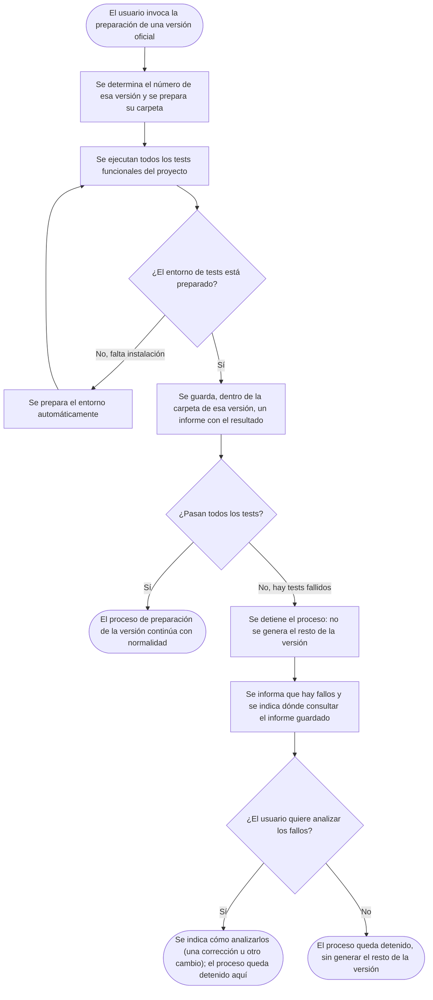

- **Name**: Ejecutar los tests funcionales antes de preparar una versión
- **Code**: 00239
- **Type**: change
- **Creation date**: 2026-09-06

## Full description

Al preparar una versión oficial del proyecto, justo después de determinar el número de esa versión y de crear su carpeta (el primer paso ya existente del proceso), se ejecuta automáticamente toda la batería de tests funcionales del proyecto sobre el código real, tal y como está organizado hoy en el editor (no sobre un entregable ya construido).

- Si el entorno de tests no está preparado (falta instalar el navegador headless necesario para ejecutarlos), se prepara automáticamente y se reintenta la ejecución una vez, sin pedir confirmación.
- En cualquier caso, pasen o no todos los tests, se guarda dentro de la carpeta de esa versión un fichero de informe con el resultado (ver "Informe de resultado de los tests" más abajo).
- Si todos los tests pasan, el proceso de preparación de la versión continúa con su flujo normal. No hace falta informar nada especial de este paso salvo que se ejecutó correctamente.
- Si algún test falla, el proceso se detiene por completo: no se genera el resto de artefactos de esa versión (ni entregable, ni documentación, ni changelog), aunque el fichero de informe sí queda guardado. Se informa al usuario que hay tests fallidos y se le indica la ruta del fichero de informe para consultar el detalle (no se le muestra la lista completa directamente en la conversación). A continuación se pregunta explícitamente si se quieren analizar esos fallos.
  - Si la respuesta es que sí: se indica que cada fallo puede tratarse como una corrección o un cambio del proyecto (por las vías ya existentes para ello), o simplemente comentarse en la conversación. No se dispara ninguna acción automática sobre los fallos. El proceso de preparación de la versión queda detenido en este punto.
  - Si la respuesta es que no: el proceso de preparación de la versión queda detenido, sin generar nada más.

Este chequeo se hace en el punto más temprano posible del proceso en el que ya se conoce el número de la versión, porque los tests siempre se ejecutan contra el código fuente real del proyecto — el mismo que después se usa para construir el entregable — y nada lo modifica entre este chequeo y la generación real. Esto garantiza que se prueba exactamente lo mismo que se va a entregar.

### Informe de resultado de los tests

Se genera siempre un fichero de informe (haya o no fallos) dentro de la carpeta de la versión en preparación, con el resultado de esa ejecución concreta. Su contenido varía según el resultado:

- **Si todos los tests pasan**: solo el resultado final y los totales (cuántos tests en total, cuántos correctos).
- **Si hay algún fallo**: además de los totales, la lista de los tests que han fallado, cada uno con lo que se esperaba y lo que se obtuvo.

Ver `design_data_test-report.md` para el detalle de qué datos contiene y un ejemplo de cada caso.

### Preguntas de alcance resueltas

- **¿En qué punto del proceso se engancha este chequeo?** Justo después de determinar el número de la versión (y crear su carpeta), no antes: en ese momento ya se garantiza que se testea exactamente el mismo código que se va a entregar, y ya existe la carpeta de la versión donde guardar el informe.
- **¿Qué ocurre si el usuario confirma que quiere analizar los fallos?** El proceso de preparación de la versión no dispara ninguna acción automática por su cuenta: se limita a indicar que los fallos pueden analizarse por las vías ya existentes del proyecto para corregir o cambiar comportamiento, o comentarse directamente en la conversación.
- **¿Qué ocurre si falta el entorno de tests (navegador headless sin instalar)?** Se prepara automáticamente y se reintenta la ejecución una vez, sin pedir confirmación al usuario ni tratarlo como un fallo de tests.
- **¿Por qué un fichero de informe aparte, en vez de mostrar la lista de fallos directamente en la conversación?** Para que el usuario pueda consultar el detalle completo por su cuenta (y conservarlo junto a la versión), en lugar de que se le tenga que volcar todo el listado como texto en el chat.
- **¿Por qué no usar TRACEABILITY.md para esto?** Se consideró y se descartó: ese fichero está pensado para no llevar fecha ni resultado de ejecución, precisamente para que su diff en control de versiones solo refleje cambios de cobertura entre funcionalidades y tests, no ruido de cada ejecución. El nuevo informe es un fichero distinto, propio de cada versión preparada.

## Technical notes

- Este cambio afecta al proceso de preparación de una versión oficial (`pv-version`), que es un skill instalado del framework y no editable directamente: sus cambios de flujo personalizables por proyecto van en `previo-sdd/stuff/custom-version-pipeline.md`. La sección a usar es **"In the middle"** (no "Before starting"): esa sección ya se ejecuta con `{XXXX}` y las rutas `versions/{XXXX}/` disponibles y sustituidas (a diferencia de "Before starting", que corre antes de resolver `XXXX`), justo después de copiar los artefactos del entregable a `files/` y antes de copiar la documentación (paso 4.1 de `pv-version`). Dado que este chequeo debe ir **antes** de generar el entregable (para no construir nada si los tests fallan), y "In the middle" ya corre después del build, `pv-how` debe decidir si esto exige un ajuste adicional (mover este chequeo a un punto intermedio entre "resolver XXXX" y "generar el entregable" que hoy `custom-version-pipeline.md` no contempla como sección propia) o si se acepta ejecutar el build igualmente y solo bloquear la copia de documentación/changelog cuando los tests fallan. Es la decisión técnica más delicada de este cambio y debe resolverse en `plan.md`.
- El formato de paso (`### Step N: {name}` con `**Command(s) to run**` / `**Generated file(s)**` / `**Notes**`) ya se usa en la sección "At the end" de ese mismo fichero (`Step 1: Empaquetar el ZIP del entregable`) — pv-how debe confirmar cómo expresar en ese formato la lógica condicional de "si falla, detener e informar y preguntar", ya que el formato existente está pensado para pasos que simplemente se ejecutan y se verifican, no para un paso interactivo/bloqueante con una pregunta al usuario.
- **Fichero de informe de resultado de tests**: se guarda dentro de `previo-sdd/versions/{XXXX}/` (a definir por `pv-how` el nombre exacto y si va en la raíz de esa carpeta o en una subcarpeta, p. ej. `test-report.md` o dentro de `docs/`). Contenido funcional y ejemplos en `design_data_test-report.md`. La fuente de los datos es la misma salida que ya produce `npm test` (ver más abajo): totales y, si hay fallos, el detalle esperado/obtenido o error de cada uno.
- Comando de ejecución: `npm test` desde la raíz del repo. Códigos de salida ya documentados en `previo-sdd/design/docs/architecture/011-functional-test-framework.md`: `0` = todos los tests pasan; `1` = algún test falla o hay alguna anomalía de trazabilidad; `2` = el navegador headless (playwright) no está instalado.
- Si el código de salida es `2`: ejecutar `npm run test:setup` (instala dependencias si hace falta más el navegador headless, ver doc 011) y reintentar `npm test` una sola vez. Si el reintento también da `2`, es un fallo real de entorno que pv-how debe decidir cómo reportar (no se debe reintentar indefinidamente).
- La lista de fallos a mostrar es literalmente la salida ya impresa por `npm test` en su resumen final (ver `src/test/run.js`, función de resumen): `Total: N — OK: X — FALLOS: Y`, seguido por cada fallo de `✗ <fichero> › <caso>` y `esperado:`/`obtenido:` (o `error:` si no es un fallo de aserción). No hace falta reprocesar ni reformatear esa salida: basta con mostrarla tal cual.
- No se ha detectado ninguna inconsistencia entre la documentación técnica (`011-functional-test-framework.md`) y el código real de `src/test/*`: se han verificado ambos y coinciden.
- Sin componente visual ni datos estructurados nuevos: es un cambio de proceso/orquestación de un skill del framework, no de UI ni de modelo de datos del proyecto.
