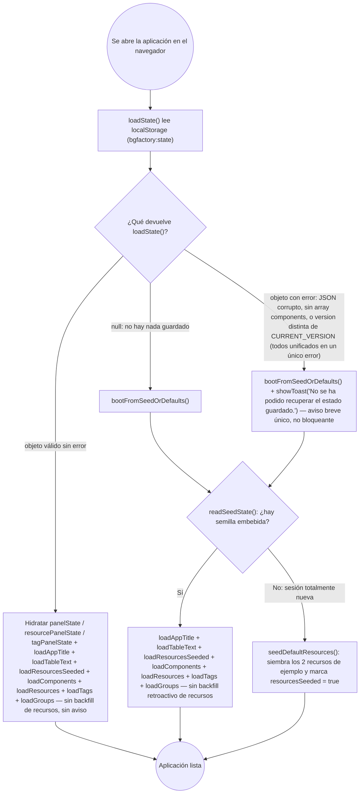

- **Creation date**: 2026-09-08

## (a) Functional notes

**Out of scope:**

- **La importación de un JSON de otra versión** (`parseImportedComponents` + `core/importMerge.js`) sigue siendo caso de uso principal y **no se endurece**: se conserva la lectura tolerante del alias `tags ?? groups ?? decks`, la normalización de pertenencia a etiquetas de los componentes importados (`normalizeComponentEtiquetaIds` en `importMerge.js`) y el relleno de registros de grupo ausentes (`deriveMissingGroups` en `editModeToggle.js`). Lo único que se retira de la importación es el paso específico de conversión de "Fichas" y su modal de errores (D1).
- **El comportamiento de una partida o un componente creados con la versión actual** no cambia en ningún caso. El valor por defecto de un componente nuevo (`bloqueado: 'ninguno'`, `accionClickDerecho: 'ninguno'`, `medidasReales: true`, `etiquetaIds: []`, `order` asignado por `addComponent`) ya lo fija `core/component.js#createComponent` y no se toca.
- **Los mensajes de error de importación por fichero inválido** (vacío, JSON corrupto, sin lista de componentes) se mantienen tal cual.
- **La comprobación de versión del guardado del navegador se conserva** como causa más de "guardado no restaurable", sin rama ni texto propios (D2) — no se elimina la validación, solo se unifica su desenlace con el de "corrupto".
- **El flag `resourcesSeeded` y `seedDefaultResources()` se conservan** (D3): una sesión totalmente nueva sigue arrancando con los 2 recursos de ejemplo, y si el usuario los borra no reaparecen. Solo desaparece el relleno retroactivo para guardados/semillas que ya traen componentes.
- **Fixtures huérfanas.** `src/test/fixtures/errantes-componentes.json` (`"version":"v00102"`, componentes `"type":"tablero"`) y `src/test/fixtures/mazo-repetido.json` existen pero **ningún test los carga** (`loadFixture` está definido en `src/test/helpers.js` y no se usa en ninguna suite). No forman parte de la verificación; se dejan como están (no se tocan ni se borran en este cambio).
- **Fichas de funcionalidad** (`design/docs/features/*`): su actualización la hace `pv-do` tras implementar, vía `pv-internal-doc-features`; este plan solo lista en (c) los cambios de documentación **de arquitectura**. Las fichas afectadas son 024 (se retira entera), 008, 022, 023, 029, 032, 036 y las cláusulas "guardado antes de este cambio" de 013, 014, 015, 016, 018 (D5: alcance amplio).
- **Artefactos de build** `src/_output/versions/index-v*.html`: no se tocan (son builds pasados, no código vivo).

**Doubts resolved with the user:** el usuario aceptó las 6 propuestas de `description.md` tal cual:

- **D1** — La eliminación de la conversión de "Fichas" se aplica también a la importación (se retira `core/fichaMigration.js` y `ui/importConversionErrorModal.js` enteros). El resto de tolerancias de formato de la importación se conservan.
- **D2** — Se mantiene `parsed.version !== CURRENT_VERSION` en `parseState` como invalidación simple, devolviendo el error unificado.
- **D3** — Se conserva el flag `resourcesSeeded` y `seedDefaultResources()`; se elimina solo el backfill retroactivo (`backfillDefaultResourcesIfNeeded`, que en el código real es el bloque en línea `if (!getResourcesSeeded()) seedDefaultResources()` de las rutas "hay guardado/semilla con componentes").
- **D4** — `compactOrders` deja de tolerar un guardado sin `order`: se ordena directamente por `component.order`.
- **D5** — Alcance amplio en documentación: se editan también las fichas 013, 014, 015, 016, 018, 022, 023 (lo hará `pv-do`).
- **D6** — Se confirma el diagrama de arranque de 3 ramas (ver sección (b)).

## (b) Technical solution

### Diagrama del arranque objetivo (tras el cambio)



Notas: (1) `loadComponents` ya no ejecuta ninguna migración — solo `compactOrders` y `state.components = components`. (2) "corrupto" y "de otra versión" caen en la misma rama, con el mismo `showToast`. (3) El backfill de recursos por defecto solo ocurre en la sesión totalmente nueva (sin guardado y sin semilla).

### Tareas

- [ ] **`src/core/fichaMigration.js` — eliminar el módulo entero.** Borrar el fichero. Tras D1 no tiene ningún consumidor (sus dos usos —`core/state.js` y `ui/editModeToggle.js`— se retiran en las tareas siguientes).
- [ ] **`src/ui/importConversionErrorModal.js` — eliminar el módulo entero.** Borrar el fichero. Su único uso está en `ui/editModeToggle.js` (`importComponentsFromFile`), que se ajusta abajo. Su CSS reutiliza la clase `import-report-modal` (de `ui/importReportModal.js`), que sigue en uso — **no** tocar CSS.
- [ ] **`src/core/state.js` — eliminar las 7 funciones de migración y sus llamadas.** Borrar las funciones `migrateFichas`, `migrateCartaMedidasReales`, `migrateGrupoIdToEtiquetaIds`, `migrateDeckIdToEtiqueta`, `migrateBloqueado`, `migrateAccionClickDerecho`, `migrateTableroSimple` (líneas ~196-309) y sus 7 líneas de llamada dentro de `loadComponents` (líneas 312-318). `loadComponents` queda:
  ```js
  export function loadComponents(components) {
    compactOrders(components);
    state.components = components;
    emit('components:changed', state.components);
  }
  ```
- [ ] **`src/core/state.js` — simplificar `compactOrders` (D4).** En la función `compactOrders` (líneas 47-57) eliminar el fallback "o por posición en el array si `order` falta". El comparador pasa a ordenar directamente por `component.order`:
  ```js
  function compactOrders(components) {
    components
      .slice()
      .sort((a, b) => a.order - b.order)
      .forEach((component, i) => { component.order = i + 1; });
  }
  ```
  (Se mantiene la función: sigue haciendo falta para recompactar `order` tras un merge de importación. Solo deja de tolerar su ausencia. `removeComponent` la sigue llamando sin cambios.)
- [ ] **`src/core/state.js` — limpiar imports muertos.** En la línea 5 quitar `import { migrateFichaComponent } from './fichaMigration.js';`. En la línea 6, quitar `normalizeComponentEtiquetaIds` del `import` desde `./component.js` (dejaba de usarse al borrar `migrateGrupoIdToEtiquetaIds`); el resto del import (`syncCopyWithOriginal, renameCopyId, updateComponent`) se conserva. **No** tocar `core/component.js`: sigue exportando `normalizeComponentEtiquetaIds` para `core/importMerge.js`.
- [ ] **`src/core/persistence.js` — unificar el error de versión en `parseState` (D2).** En `parseState` (líneas 18-23) sustituir la rama de versión para que devuelva el error unificado:
  ```js
  // Objeto legible pero de otra versión de la app: al no haber todavía una
  // versión publicada, se trata como un guardado no restaurable más, sin
  // aviso ni rama propios.
  if (parsed && parsed.version !== CURRENT_VERSION) {
    return { error: 'corrupt' };
  }
  ```
  (Se mantiene la comprobación; solo cambia el string devuelto. `readSeedState` no cambia: sigue con `return result.error ? null : result;`.)
- [ ] **`src/core/persistence.js` — quitar las cadenas de compatibilidad de `parseState`.** En `parseState`:
  - Línea 33: `const tagPanelStateRaw = parsed.tagPanelState ?? parsed.groupPanelState ?? parsed.deckPanelState;` → `const tagPanelStateRaw = parsed.tagPanelState;`
  - Línea 37: `const tags = Array.isArray(parsed.tags) ? parsed.tags : (Array.isArray(parsed.groups) ? parsed.groups : (Array.isArray(parsed.decks) ? parsed.decks : []));` → `const tags = Array.isArray(parsed.tags) ? parsed.tags : [];`
  - Ajustar el comentario de las líneas 29-32 (ya no describe una cadena de 3 niveles en el arranque).
  - **`parseImportedComponents` NO se toca**: conserva `parsed.tags ?? parsed.groups ?? parsed.decks` (línea 85) — la importación de otra versión es caso de uso principal (D1).
- [ ] **`src/main.js` — unificar la rama de arranque `version-mismatch`.** En el bloque `const saved = loadState();` (líneas 167-199): eliminar la rama `if (saved?.error === 'version-mismatch') { ... }` (líneas 168-170). La rama `else if (saved?.error === 'corrupt')` pasa a ser `if (saved?.error === 'corrupt')` y cubre ambos casos (tras la tarea de `persistence.js`, `parseState` ya no devuelve `'version-mismatch'`; dejar la rama solo por claridad del string). Actualizar el comentario de las líneas 141-142 ("Mismo camino para..."): ya no hay que enumerar "estado de otra versión" como caso distinto.
- [ ] **`src/main.js` — eliminar el backfill retroactivo de recursos (D3).** Quitar el bloque `if (!getResourcesSeeded()) { seedDefaultResources(); }` en los **dos** puntos donde rellena un guardado/semilla que ya trae datos:
  - Dentro de `bootFromSeedOrDefaults()`, rama `if (seed) { ... }` (líneas 153-155).
  - En la rama `else if (saved)` del bloque de arranque de abajo (líneas 194-196).
  - **Conservar** la rama `else { seedDefaultResources(); }` de `bootFromSeedOrDefaults()` (línea 156-158): esa es la sesión totalmente nueva (sin guardado y sin semilla), no un backfill.
  - Actualizar el comentario de las líneas 160-166 ("Guardado/semilla sin `resourcesSeeded`...") para que describa solo la siembra de sesión nueva.
- [ ] **`src/main.js` — limpiar el import de `t` si queda sin uso tras quitar el toast.** Tras eliminar la rama `version-mismatch`, `t('toast.stateRecoverFailedVersion')` desaparece pero `t` sigue usándose (`t('toast.stateRecoverFailedCorrupt')`, `t('appVersion.repoLink')`, recursos semilla). No hay import que quitar; solo verificar que no queda ninguna referencia a `stateRecoverFailedVersion`.
- [ ] **`src/ui/editModeToggle.js` — quitar el paso de migración de fichas de la importación.** En `importComponentsFromFile` (líneas 79-139):
  - Eliminar el bucle que separa `migratedSelectedComponents` / `conversionErrors` recorriendo `selectedComponents` y llamando a `migrateFichaComponent` (líneas 81-91).
  - `proceedWithImport(components)` pasa a recibir directamente `selectedComponents`.
  - Eliminar el bloque `if (conversionErrors.length === 0) { proceedWithImport(...); return; }` + la llamada a `openImportConversionErrorModal({ ... })` (líneas 127-139). En su lugar, llamada directa: `proceedWithImport(selectedComponents);`.
  - Quitar los imports `import { openImportConversionErrorModal } from './importConversionErrorModal.js';` (línea 17) y `import { migrateFichaComponent } from '../core/fichaMigration.js';` (línea 18).
  - **Conservar** el import y uso de `deriveMissingGroups` (línea 9 y ~120): sigue haciendo falta para ficheros de importación sin `componentGroups`.
- [ ] **`src/data/i18n.es.js` y `src/data/i18n.en.js` — eliminar claves i18n muertas.** Borrar en ambos ficheros:
  - `toast.stateRecoverFailedVersion` (es línea 11 / en línea 13).
  - `import.conversionError.heading`, `.message`, `.abort`, `.continue`, `.colFicha`, `.colError` (es líneas 67-72 / en líneas 69-74).
  - `fichaMigration.error.missingDesign`, `.missingShape`, `.unknownShape`, `.incompleteImageAdjust` (es líneas 591-594 / en líneas 593-596).
  - **Conservar** `toast.stateRecoverFailedCorrupt` y `import.progress`.
- [ ] **`src/test/functional/autosave.test.js` — ajustar `FT-029-08`.** En la línea 122-123, un guardado con `version: 999999` debe pasar a esperar el error unificado:
  ```js
  localStorage.setItem('bgfactory:state', JSON.stringify({ version: 999999, components: [] }));
  expect(loadState().error).toBe('corrupt');
  ```
  Ajustar también el título del `it` si menciona "otra versión" como caso distinto de "corrupto" (línea 115: "distingue misma versión / otra versión / corrupto / inexistente" → p. ej. "distingue guardado válido / no restaurable / inexistente"), y el comentario de la línea 129 si procede.
- [ ] **Buscar y limpiar referencias de comentario colgantes.** `rg -n "fichaMigration|importConversionErrorModal|version-mismatch|stateRecoverFailedVersion|migrateFicha|migrateBloqueado|migrateTableroSimple|migrateDeckId|migrateGrupoId|migrateCartaMedidasReales|migrateAccionClickDerecho|backfillDefaultResources" src --glob '!_output/**'` no debe devolver nada en código vivo salvo, como mucho, un comentario en `src/ui/styleClipboardErrorModal.js` línea 4 (menciona `importConversionErrorModal.js` como referencia de patrón visual): actualizar ese comentario para que no apunte a un fichero borrado (referir en su lugar a `ui/importReportModal.js`, que aporta la misma tabla/ancho). Revisar también `src/core/cardProportions.js` línea ~141 (comentario que menciona `migrateCartaMedidasReales` como origen del factor de conversión): reescribir para que no cite una función eliminada, sin cambiar la constante.

## (c) Architecture changes

Esta solución retira comportamiento descrito en la documentación de arquitectura. Actualizar (lo hará `pv-do` en su paso de documentación):

- **`design/docs/architecture/004-groups-resources.md`**:
  - Sección **"Backward compatibility"** (tabla de la cadena `tags → groups → decks` / `tagPanelState → groupPanelState → deckPanelState`): dejar claro que esa cadena **solo aplica ya a `parseImportedComponents` (importación)**, no a `parseState` (arranque). El arranque lee únicamente `tags` / `tagPanelState`.
  - Sección **"'ficha' component migration"** (líneas ~99-124, incluida la tabla de `migrateFichaProperties` y la tabla "Two use points"): eliminarla entera. El módulo `core/fichaMigration.js` y ambos puntos de uso desaparecen. Dejar, si acaso, una frase en el modelo de `'carta'` diciendo que el tipo `'ficha'` fue retirado antes de la 1.0 y no dejó rastro que migrar.
  - Sección **"Resource data model (gallery)"**, párrafo final sobre `backfillDefaultResourcesIfNeeded()` (líneas ~95): quitar la mención al backfill retroactivo. `resourcesSeeded` + `seedDefaultResources()` (sesión nueva) se conservan.
- **`design/docs/architecture/007-persistence-build.md`**:
  - **Tabla de retornos de `parseState`** (líneas ~19-24): eliminar la fila `{ error: 'version-mismatch' }`; el caso "objeto de otra versión" pasa a la fila `{ error: 'corrupt' }`. Ajustar la nota "(checked before the `components` check...)" para que refleje que el desenlace es el mismo error.
  - Bloque de arranque **`Startup (main.js)`** (líneas ~27-45): eliminar la línea `{ error: 'version-mismatch' } → ... showToast('No se ha podido recuperar el estado de una versión anterior...')`. Dejar solo `{ error: 'corrupt' } → bootFromSeedOrDefaults() + showToast('No se ha podido recuperar el estado guardado.')`. Ajustar el `[gotcha]` y la frase "`'version-mismatch'` and `'corrupt'` run the exact same fallback path" (ya no hay dos strings). Quitar `backfillDefaultResourcesIfNeeded` de las secuencias de hidratación (arranque con guardado válido y arranque desde semilla).
  - Sección **"Default resources and backfill"** (líneas ~104-110): reescribir la tabla. Fila 1 ("Fully new session...") se mantiene pero sin la coletilla "or `parseState` returned `{ error: 'corrupt' }` / `{ error: 'version-mismatch' }`" — con el error unificado, basta "or `parseState` returned an error". Eliminar la fila 2 ("Valid save or seed ... but `resourcesSeeded` not `true` ... `backfillDefaultResourcesIfNeeded()`"). Fila 3 se mantiene.
  - Sección **"Backward compatibility"** (líneas ~62): acotar a que `parseState` ya no lee los alias `groups`/`decks`; solo `parseImportedComponents` los conserva.
  - Sección **"Export/Import with selection"**, paso 4 del flujo de importación (líneas ~89): eliminar la mención a que `editModeToggle.js` pasa cada componente `'ficha'` por `migrateFichaComponent` y abre `openImportConversionErrorModal`. La importación ya no convierte fichas.

## (d) Style changes

No aplica: no se modifica ni extiende el estilo visual. Se borra `ui/importConversionErrorModal.js`, que reutilizaba clases CSS existentes (`import-report-modal`, cabecera de `errorModal`) sin definir ninguna propia; esas clases siguen en uso desde otros módulos y no se tocan.

## (e) Verification

- [ ] **Arranque en sesión nueva.** Con `localStorage` vacío y sin `<script id="initial-state">` con contenido, abrir la app: arranca sin componentes, con los 2 recursos de ejemplo en la galería "Recursos", sin ningún aviso.
- [ ] **Arranque con guardado válido de la versión actual.** Crear algún componente, recargar: se restaura tal cual, sin aviso, y —si antes se habían borrado los recursos de ejemplo— **no reaparecen**.
- [ ] **Arranque con guardado de otra versión.** En consola: `localStorage.setItem('bgfactory:state', JSON.stringify({ version: 999999, components: [] }))` y recargar: la app arranca con el contenido de respaldo (semilla o por defecto) y muestra **un único** aviso breve no bloqueante "No se ha podido recuperar el estado guardado." (el mismo que para un guardado corrupto — no el mensaje antiguo específico de versión anterior).
- [ ] **Arranque con guardado corrupto.** En consola: `localStorage.setItem('bgfactory:state', '{ no es json')` y recargar: mismo desenlace y mismo texto de aviso que el punto anterior.
- [ ] **Importar un JSON con una etiqueta bajo el nombre antiguo.** Importar un fichero cuyo JSON traiga `"groups": [...]` (sin `"tags"`): las etiquetas se importan igualmente (la tolerancia de la importación se conserva).
- [ ] **Importar un JSON que contenga un componente `"type": "ficha"`.** El componente se importa **sin** ninguna ventana de "Errores al convertir fichas" y sin conversión automática a carta: entra tal cual (o se comporta como un tipo desconocido según el resto del sistema), pero el flujo de importación **no** abre ningún modal de conversión.
- [ ] **Búsqueda de referencias muertas.** `rg -n "fichaMigration|importConversionErrorModal|version-mismatch|stateRecoverFailedVersion|migrateFicha" src --glob '!_output/**'` no devuelve resultados en código vivo (comentarios incluidos).
- [ ] **Suite funcional.** Ejecutar los tests funcionales (`src/test/run.js` / la página runner): `FT-029-08` y el resto de `autosave.test.js` y `fresh-boot.test.js` pasan en verde.
- [ ] **Build.** `python src/scripts/build.py` genera el deliverable sin errores de resolución de imports (no queda ningún `import` a `core/fichaMigration.js` ni a `ui/importConversionErrorModal.js`).
