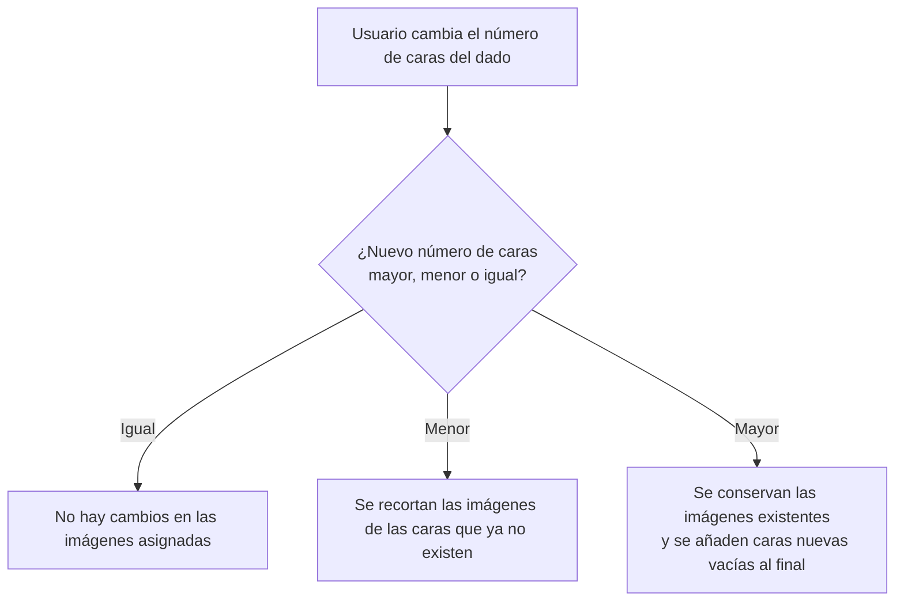

# Idea: dbvq0

## Idea
Imágenes por cara en dados

## Code
dbvq0

## Creation date
2026-09-02

## Notes
Idea degradada desde el cambio/fix `00052` (originalmente tipo `change`) el 2026-09-02 por despriorización. Su material de análisis se conserva completo en esta carpeta.

### Descripción funcional (copiada del cambio)

Se añade a la configuración de caras de los dados una tercera forma de definir las caras, junto a las dos que ya existen (número máximo de caras, y lista de valores): un modo de **imágenes por cara**, en el que cada cara del dado muestra una imagen en lugar de un número.

Al elegir este modo, se muestra una entrada por cada cara del dado (según el número de caras configurado), y cada entrada permite asignar una imagen y ajustarla individualmente (recorte y zoom), igual que ya se puede hacer hoy con la imagen de una ficha.

Los tres modos de caras son excluyentes entre sí: un dado está en uno de los tres modos a la vez, nunca combinándolos.

#### Casos límite resueltos

- **Cara sin imagen asignada**: se muestra como un hueco vacío (placeholder), igual que ocurre hoy con una ficha sin imagen asignada. Nunca se muestra un número de respaldo en su lugar.
- **Cambio en el número de caras** después de haber asignado imágenes: la asignación existente se conserva por posición.

- **Ajuste de una imagen a medias / cancelado**: si el usuario abre el editor de ajuste de una cara y cancela sin confirmar, esa cara conserva la imagen y el ajuste que tenía antes de abrir el editor (o queda vacía si no tenía ninguna).

#### Convivencia con lo existente

No sustituye a los modos actuales de caras (número máximo, lista de valores): es una tercera alternativa más, seleccionable de la misma forma que las otras dos.

#### Alcance de los datos

La configuración de imágenes por cara se guarda junto con el resto de propiedades del dado, como parte de los datos del proyecto — igual que el resto de configuración de componentes. El proyecto no distingue usuarios ni sesiones, por lo que esta configuración persiste igual para cualquiera que abra el proyecto guardado, y se mantiene igual al recargar.

#### Quién puede usarlo

Se configura desde el mismo sitio donde hoy se elige el modo de caras del dado (modo de edición del componente). No introduce ningún rol o restricción de uso nuevo respecto a los que ya existen para otros componentes con imagen (como la ficha).

#### Definición visual de alto nivel

- En el modal de configuración del dado, junto al selector de modo de caras existente, aparece la nueva opción "imágenes por cara".
- Al seleccionarla, se muestra una lista con una miniatura por cada cara del dado.
- Cada miniatura es pulsable y abre el mismo editor de ajuste de imagen ya usado para la ficha (arrastre + zoom sobre la imagen elegida), con un botón para aceptar el ajuste o cancelar sin aplicar cambios.
- Una miniatura sin imagen asignada se muestra como un hueco vacío con indicación de que falta configurar esa cara.
- En el tablero, la cara del dado en este modo pinta la imagen ya ajustada en el lugar donde hoy se pinta el número, recortada exactamente a la silueta 2D que ya tiene ese dado según su número de caras (triángulo, cuadrado, diamante o forma redondeada de muchas caras) — nunca como un recorte cuadrado genérico que ignore la forma del dado. Una cara sin imagen asignada muestra ese mismo hueco vacío recortado a su silueta correspondiente.

### Material preservado

- `original-change-description.md` — la entrada original del cambio, incluyendo su sección **Technical notes** (modelo de datos del dado, reutilización de `imageAdjustModal.js` del change 00029, `renderDiceSilhouette` en `componentRenderer.js`, incongruencia detectada entre `ARCHITECTURE.md` e `isResourceInUse`, etc.).
- `original-change-history.md` — el historial de prompts de la conversación del cambio.
- `design_cara-dado-tablero.html` — maqueta de la cara del dado en el tablero, con los puntos de recorte exactos para las 4 siluetas.
- `design_lista-caras-imagenes.html` — maqueta de la lista de caras con miniaturas en el modal de configuración.
