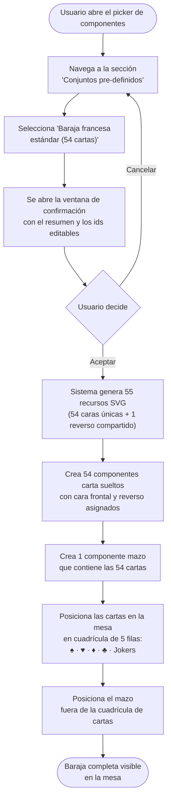
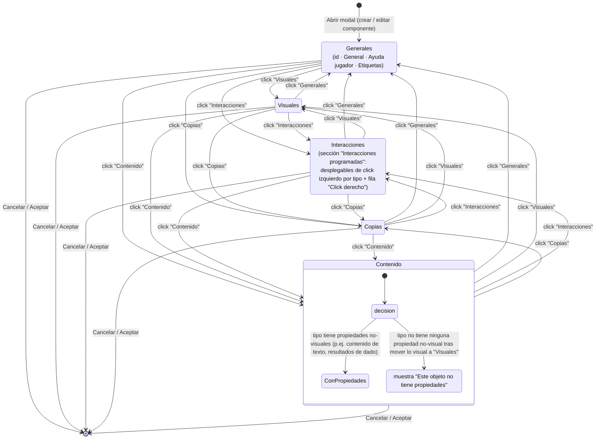

# 002 — Alta/edición/borrado de componentes con modal de tabs

**Area**: Mesa de juego

Modal con cinco pestañas (cambio 00269: cada una con un icono identificativo junto al texto — "Generales" con el `id` editable, "Visuales" con todo lo que afecta al aspecto del componente, "Contenido" según el tipo con el resto de configuración propia de cada tipo, "Interacciones" con los ajustes de qué hace el click sobre el componente en Modo Juego y "Copias" con la gestión de copias vinculadas) para crear o editar un componente, con validación de `id` no vacío y único. La pestaña activa se resalta con fondo blanco, borde inferior azul y su icono también en azul. Al abrir la modal, la pestaña activa es siempre "Generales". Al cambiar entre pestañas, el borde superior de la modal permanece siempre en el mismo punto de la pantalla (cambio 00284): como cada pestaña tiene una altura de contenido distinta, la modal deja más o menos espacio libre por debajo según la pestaña activa, pero nunca se desplaza verticalmente — el usuario solo percibe el cambio de contenido, nunca un salto de posición. Si ni siquiera la pestaña más alta cabe en la pantalla disponible, la modal recorta su contenido con scroll interno, igual que hacía antes de este cambio. Al editar un componente ya existente (no al crear uno nuevo), la modal incluye además un botón "Eliminar" en el extremo izquierdo de la zona de botones, con el mismo estilo destructivo (rojo) que el resto de acciones de borrado de la app; pide confirmación igual que el borrado desde el panel flotante y, si se confirma, borra el componente y cierra la modal (limpiando también la selección en el editor si el componente eliminado era el seleccionado). Es un camino alternativo al borrado desde el panel flotante, no lo sustituye.

Al pulsar "+ Añadir componente" se muestra antes una modal previa con la lista de tipos disponibles ("Cuadro de texto", "Tablero simple", "Tablero personalizado", "Dado Configurable", "Visor de documentos", "Carta/Ficha" y "Mazo"), cada uno en una fila seleccionable, y botones "Cancelar"/"Aceptar". Cada fila muestra un pequeño icono ilustrativo del tipo, entre el selector y el nombre, que ayuda a reconocerlo de un vistazo; el icono se ve atenuado en gris y pasa al color de acento cuando el cursor está sobre la fila o cuando ese tipo está seleccionado. El icono es solo ilustrativo: pulsar sobre él equivale a pulsar en la fila. Al aceptar, el componente se crea y se añade de inmediato con los valores por defecto de ese tipo, y a continuación se abre esta misma modal de configuración ya sobre ese componente para ajustar sus propiedades — el tipo, una vez elegido, no se puede cambiar.

Debajo de esa lista de tipos individuales, un separador de texto ("o elige un conjunto pre-definido") introduce una segunda sección con conjuntos completos listos para usar de una sola acción. Por ahora incluye un único conjunto, "Baraja francesa estándar (54 cartas)": una fila destacada visualmente (fondo e icono en el color de acento) con un par de etiquetas informativas ("52 cartas + 2 jokers", "1 mazo") y una flecha que indica que ejecuta una acción.

A diferencia de los tipos individuales, pulsar este conjunto no crea el resultado de inmediato: abre antes una ventana de confirmación (cambio 00275), quedando la modal "Añadir componente" abierta detrás. La ventana de confirmación muestra un resumen de cuántos elementos se van a crear y de qué tipo (para la baraja francesa: 54 recursos nuevos, 54 componentes carta —52 cartas + 2 comodines— y 1 componente mazo) y permite escribir dos identificadores antes de confirmar, ambos ya rellenos con un valor por defecto: el identificador del componente mazo que se va a crear y el prefijo de identificador de las cartas (sustituye el prefijo por defecto que llevarían las cartas generadas, manteniendo el resto del patrón de nombrado). Tiene dos botones:

- **Cancelar**: cierra solo la ventana de confirmación. La modal "Añadir componente" sigue visible, sin haberse creado ningún elemento ni modificado la mesa.
- **Aceptar**: cierra la ventana de confirmación y la modal "Añadir componente" a la vez, y crea el conjunto de componentes con los identificadores indicados. Si el identificador del mazo o el de alguna carta resultante coincide con uno ya existente en la partida, se renombra automáticamente añadiendo un sufijo numérico entre paréntesis, sin bloquear la confirmación ni mostrar un error. Mientras se crea, se muestra brevemente un indicador de progreso.

Este mecanismo de confirmación es genérico: se aplica a cualquier conjunto pre-definido que exista o se añada en el futuro, no solo a la baraja francesa.

Al confirmar "Baraja francesa estándar (54 cartas)" se crean automáticamente: 55 recursos de imagen nuevos en la galería (54 caras de carta únicas más 1 reverso compartido por todas), 54 componentes "Carta/Ficha" (los 4 palos, As a K, más 2 comodines) ya con su cara frontal y su reverso asignados, y 1 componente "Mazo" que las contiene. El componente "Mazo" generado recibe por defecto el identificador legible "Baraja Francesa" (cambio 00276; con desambiguación si ya existe, mismo criterio que las 54 cartas) salvo que el usuario haya escrito otro en la ventana de confirmación, de forma que aparece identificado así en el panel flotante de componentes en vez de con un identificador técnico opaco — igual que las 54 cartas, que por defecto se identifican con ids legibles del tipo "card-picas-as" (o con el prefijo alternativo que el usuario haya indicado en vez de "card-"). Las 54 cartas se crean sueltas, sin agruparse entre sí, y se colocan ya dispuestas en la mesa en una cuadrícula de 5 filas — picas, corazones, diamantes, tréboles (cada una de As a K) y una última fila con los 2 comodines —, con el mazo aparte, fuera de la cuadrícula. El diseño de cada carta sigue las convenciones de una baraja francesa: valor y palo en las esquinas superior-izquierda e inferior-derecha, símbolo del palo centrado (notablemente más grande en los ases), un adorno distintivo que identifica a las figuras (J, Q, K), un diseño multicolor común para ambos comodines, y un reverso con un patrón geométrico azul y blanco, idéntico en las 54 cartas.

La pestaña "Generales" incluye, en este orden: un desplegable "Bloqueado" (cambio 00138, antes checkbox; "Ninguno" por defecto para cualquier tipo — ver [Posición independiente, arrastre y redimensionado de componentes](015-posicion-independiente-arrastre-y-redimensionado-de-componentes.md)); tres checkboxes — "Oculto" (ver [Componente oculto en modo juego](016-componente-oculto-en-modo-juego.md)), "Mostrar tooltip" (ver [Identificación de componentes al pasar el ratón](025-identificacion-de-componentes-al-pasar-el-raton.md)) y "Subir al mover/interactuar" (ver [Subir al mover/interactuar](013-subir-al-mover-interactuar.md)) —; y, tras ellos, una sección "Etiquetas" (ver [Etiquetas, organización de elementos por nombre](008-grupos-organizacion-de-elementos-por-nombre.md)). Junto a la etiqueta de cada uno de estos campos hay un icono de ayuda "?" que muestra, al pasar el ratón por encima, una breve explicación de qué hace — patrón de ayuda contextual reutilizable en toda la app (tooltip para textos cortos, ventana modal para textos largos o con formato).

**Pestaña "Visuales"** (cambio 00210): agrupa todo lo que afecta al aspecto del componente, sea transversal a los 8 tipos o específico de uno de ellos.

- **Tamaño**: campos "Alto"/"Ancho" y checkbox "Mantener proporción", igual para los 8 tipos.
- **Extrusión**: una fila con dos campos — "Profundidad" (número en píxeles, de 0 a 40, 0 por defecto salvo en "Dado") y "Color de extrusión" (selector de color; mientras no se toque, se usa un cálculo automático de un tono más oscuro del color propio del componente). Da al componente una apariencia de cuerpo sólido con grosor real — un bloque con un lateral visible — en vez de plano, convive sin conflicto con el bisel o la sombra de contacto que ya tuviera. Sin efecto visible en "Cuadro de texto" (icono de ayuda junto al título de la sección lo indica), tenga o no tenga fondo de color configurado. El componente "Dado" ya no simula profundidad con un mecanismo propio y fijo — usa esta misma propiedad general, con un valor inicial que mantiene una sensación de grosor similar a la que tenía antes.
- **Controles visuales específicos por tipo**, trasladados desde "Contenido": "Biselado en el borde"/"Sombra"/color y grosor del borde/selector de fondo de "Tablero simple" (ver [Componente "tablero simple"](018-componente-tablero-simple.md)); "Biselado en el borde"/"Sombra" de "Tablero personalizado" (ver [Componente "tablero personalizado"](019-componente-tablero-personalizado.md)); color del cuerpo/color de los números/tipografía de "Dado" (ver [Componente "dado"](020-componente-dado.md)); tamaño de letra/color de texto/color de fondo de "Cuadro de texto" (ver [Componente "cuadro de texto"](017-componente-cuadro-de-texto.md)); forma y orientación de "Mazo" (ver [Componente "mazo"](023-componente-mazo.md)).

Las secciones de esta pestaña se muestran siempre en este orden, de arriba a abajo: **Estilo** (solo Dado), **Forma** (solo Mazo), **Borde** (tableros), **Extrusión** (todos) y **Efecto** (Cuadro de texto y tableros); "Tamaño" va siempre la primera, antes de ese grupo. Un tipo que no tenga alguna de esas secciones simplemente no la muestra y las siguientes suben.

**Pestaña "Contenido"**: tras el traslado anterior, contiene solo lo que no es puramente visual de cada tipo (contenido de texto, resultados de dado, contenido/imagen de mazo, tipo/contenido/URL de documento, proporción y botón "Editar diseño de la carta" de "Carta", botón "Editar diseño del tablero" de "Tablero personalizado"). Si para un tipo no queda ninguna propiedad no-visual que mostrar (caso de "Tablero simple" tras este cambio), la pestaña muestra el mensaje "Este objeto no tiene propiedades" en vez de quedar en blanco.

**Pestaña "Interacciones"** (cambio 00251): contiene la sección "Interacciones programadas" (ver [Interacciones programadas de un componente](014-interacciones-programadas-de-un-componente.md)) con un desplegable por cada interacción de click izquierdo que tenga programada el tipo que se está editando, más una fila fija para configurar el click derecho, disponible por igual para cualquier tipo. Esta pestaña se muestra siempre, para los 8 tipos: aunque un tipo no tenga ninguna interacción de click izquierdo (cuadro de texto, tablero simple, visor de documentos), la fila fija de click derecho hace que nunca quede vacía.

**Pestaña "Copias"**: gestión de las copias vinculadas a un original (ver [Elementos tipo Copia, vinculados y sincronizados con un original](005-elementos-tipo-copia-vinculados-y-sincronizados-con-un-original.md)).

- **Available in**: modo edición — desde el panel flotante de componentes o haciendo doble click directamente sobre la representación del componente en la mesa.
- **Code**: 00002, 00003, 00004, 00013, 00015, 00018, 00019, 00020, 00029, 00053, 00061, 00087, 00100, 00105, 00106, 00115, 00138, 00142, 00210, 00234, 00236, 00251, 00255, 00269, 00271, 00272, 00275, 00276, 00284.
- **Since**: 2026-07-17
- **Last modified**: 2026-09-15
